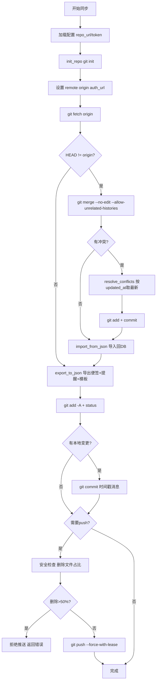
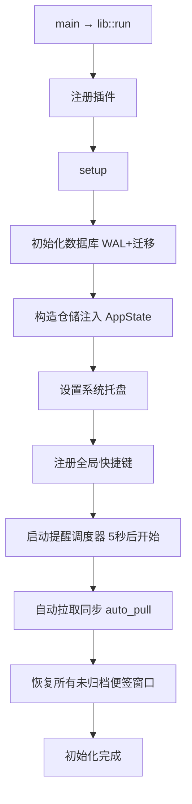
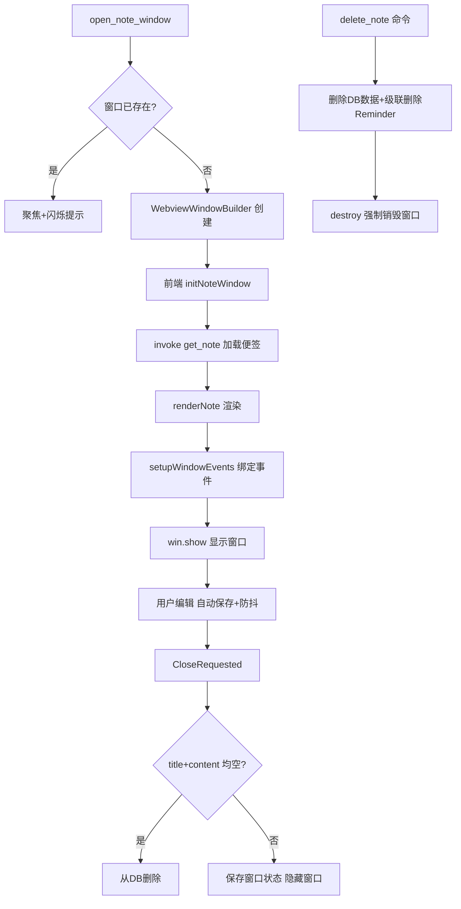
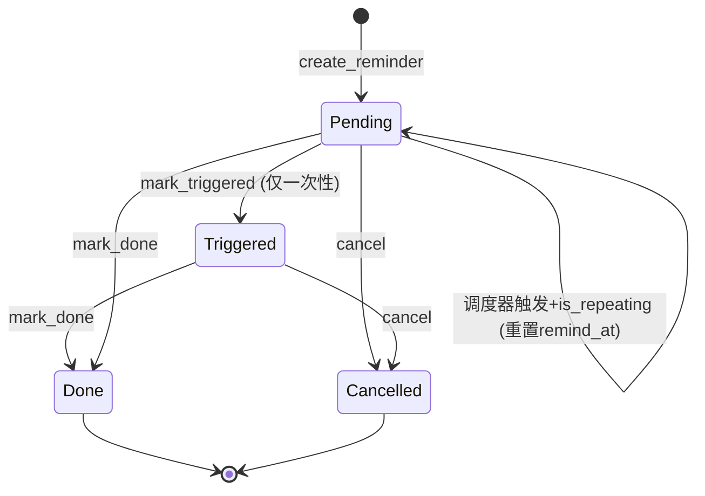

# 业务流程与状态机

> **TL;DR**: 关键流程：Git 同步、应用启动、便签窗口生命周期。关键状态机：Reminder。⚠️ 提醒一旦 Done/Cancelled 不可恢复；一次性提醒触发后不可重新触发。

---

## 业务流程

### Git 同步流程

**触发条件**: 用户点击"立即同步"或自动同步触发（30 秒防抖）

**参与者**: GitSync 模块、Git 平台、本地 SQLite

**异常处理**:

| 异常场景 | 处理方式 |
|----------|----------|
| Git 未安装 | `check_git` 返回 false，设置页显示警告 |
| 网络/认证失败 | 返回错误字符串，前端显示同步失败 |
| merge 冲突 | 解析冲突标记，按 updated_at last-write-wins |
| merge 失败后仍有未解决冲突 | 拒绝 push，返回错误 |
| push 前删除文件占比>50% | 拒绝推送，防止远程数据被覆盖 |
| push 被拒绝 | --force-with-lease 强制推送 |

### 已知策略缺口

无（提醒导入已遵循 last-write-wins，与便签导入逻辑一致）。

---

### 应用启动流程

**触发条件**: 应用启动

**参与者**: lib.rs setup、数据库、调度器、窗口管理器

---

### 便签窗口生命周期

**触发条件**: 用户创建/打开便签、启动恢复、提醒触发

**参与者**: window_manager、前端 main.ts

---

## 状态机

### Reminder 状态机

**初始状态**: Pending

### 状态说明

| 状态 | 含义 | 允许的操作 |
|------|------|------------|
| Pending | 等待触发 | snooze, mark_done, cancel, 调度器触发 |
| Triggered | 已触发（一次性提醒） | mark_done, cancel |
| Done | 已完成 | 无（终态） |
| Cancelled | 已取消 | 无（终态） |

### 转换规则

| 从 | 到 | 触发条件 | 副作用 |
|----|-----|----------|--------|
| (创建) | Pending | create_reminder | 写入 DB |
| Pending | Pending | snooze(n) | 设置 snoozed_until |
| Pending | Pending | 调度器触发 + is_repeating | 计算 next_trigger，更新 remind_at |
| Pending | Triggered | 调度器触发 + !is_repeating | 发送通知，创建便签窗口 |
| Pending | Done | mark_done (dismiss_reminder) | 更新 status |
| Pending | Cancelled | cancel (delete_reminder) | 从 DB 删除 |
| Triggered | Done | mark_done | 更新 status |
| Triggered | Cancelled | cancel | 从 DB 删除 |

### 禁止的转换

| 从 | 到 | 原因 |
|----|-----|------|
| Done | Pending | 已完成不可恢复 |
| Cancelled | Pending | 已取消不可恢复 |
| Triggered | Pending | 一次性提醒触发后不可重置（周期提醒不进入 Triggered） |
| Done | Triggered | 终态不可转换 |
| Cancelled | Triggered | 终态不可转换 |

---

## 跨模块事件联动

| 触发方 | 事件 | 受影响方 | 联动动作 | 失败处理 |
|--------|------|----------|----------|----------|
| Reminder Scheduler | 提醒到期 | Note Window | 后端直接创建便签窗口（URL 带 reminder 参数） | 窗口创建失败则仅发通知 |
| Reminder Scheduler | 提醒到期 | Notification | 发送系统通知（标题=note_title） | 通知失败不影响窗口创建 |
| delete_note 命令 | Note 删除 | Reminder | 级联删除关联 Reminder | DB ON DELETE CASCADE 兜底 |
| delete_note 命令 | Note 删除 | Note Window | destroy 强制销毁窗口（INV-026） | 窗口获取失败仅记录日志 |
| Git Sync | 同步完成 | Note + Reminder | import_from_json 更新本地数据 | 导入失败回滚 |
| Note 窗口关闭 | CloseRequested | Note 数据 | 空便签删除，非空保存窗口状态 | 保存失败记录日志 |

---

## 变更记录

| 日期 | 变更内容 | 变更人 | 关联变更 |
|------|----------|--------|----------|
| 2026-07-09 | 初始版本，按模板结构填充 | — | — |
| 2026-07-09 | 更新提醒导入策略缺口为已修复 | — | #REFACTOR-001 |
| 2026-07-09 | 调度器周期重置改用 domain 方法 reset_for_next_trigger | — | #REFACTOR-002 |
| 2026-07-19 | Git 同步流程图更新为“先拉后推”；便签窗口生命周期补充 delete_note 路径；跨模块事件联动表补充 delete_note→window destroy | AI | v0.8.5 同步更新 constraints.md |
